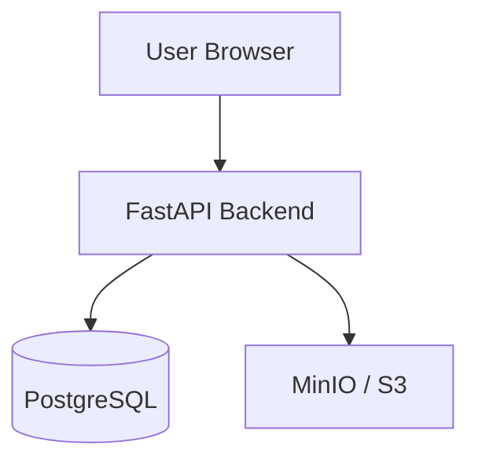

# Secure Keyword Search and Key Management Scheme in Cloud Environment

Educational-but-realistic system demonstrating how sensitive files can be stored **encrypted** in an untrusted cloud while still allowing **authorized keyword search** without sending plaintext keywords to the cloud index and without decrypting the entire dataset.

> **Honesty notice:** This project does **not** claim zero knowledge, zero leakage, perfect privacy, or protection against all inference attacks. The searchable-encryption design uses deterministic HMAC-SHA-256 tokens and therefore leaks **equality of repeated queries** (search-pattern leakage), plus access-pattern and metadata leakage. See [docs/SEARCHABLE_ENCRYPTION.md](docs/SEARCHABLE_ENCRYPTION.md) and [docs/THREAT_MODEL.md](docs/THREAT_MODEL.md).

## Problem statement

Cloud object storage and databases are convenient but often **less trusted**. Naïve encryption makes search impossible without downloading and decrypting everything. This project shows a practical envelope-encryption + deterministic searchable-index approach suitable for teaching cybersecurity students.

## Objectives

- Client/application-side encryption before object storage (AES-256-GCM)
- Per-document Data Encryption Keys (DEKs) wrapped by a versioned KEK/master key
- Separate search key producing HMAC-SHA-256 search tokens
- Authorization-filtered search over a protected index
- Key versioning, rotation, re-indexing, and revocation
- Audit logging, security tests, and explainable documentation

## Key features

- JWT authentication + Argon2id password hashing + refresh-token rotation
- USER / ADMIN roles with ownership checks (IDOR defenses)
- MinIO/S3-compatible storage abstraction + local filesystem provider
- Admin key-status, rotate search, rotate master, reindex APIs
- React UI for upload, protected search, download, and admin key/audit views
- Unit, integration, and security tests (including ciphertext tamper detection)

## Architecture (summary)



Details: [docs/ARCHITECTURE.md](docs/ARCHITECTURE.md) · Diagrams: [docs/diagrams/](docs/diagrams/)

## Technology stack

| Layer | Technology |
|-------|------------|
| Frontend | React, Vite, TypeScript, Tailwind, TanStack Query, Axios |
| Backend | Python 3.12, FastAPI, Pydantic, SQLAlchemy, Alembic |
| DB / objects | PostgreSQL 16, MinIO |
| Auth | JWT, Argon2id |
| Crypto | `cryptography` (AES-256-GCM, HMAC-SHA-256, HKDF) |

## Security model / threat model (summary)

**Trusted:** browser (to a point), application backend, key-management code, `MASTER_KEY` secret source.

**Less trusted:** object storage, database contents, network intermediaries.

**Fatal if lost:** fully compromised application server (plaintext and keys available during legitimate decrypt/encrypt). Documented in [docs/THREAT_MODEL.md](docs/THREAT_MODEL.md).

## Cryptographic design

- **Document:** unique 256-bit DEK → AES-256-GCM (unique 96-bit nonce)
- **Envelope:** DEK wrapped with AES-GCM under HKDF-derived KEK from `MASTER_KEY` + version
- **Search:** `token = hex(HMAC-SHA-256(search_key, normalize(keyword)))`
- **Separation:** DEK ≠ Search Key ≠ Master/KEK

## Search workflow

1. Normalize keyword (trim, NFKC, lower, punctuation policy)
2. Generate HMAC token with active search key
3. Look up `search_index` by token + key version
4. Filter by ownership/authorization
5. Return metadata only — decrypt happens on authorized download

## Setup

### 1. Environment

```bash
cp .env.example .env
python scripts/gen_dev_secrets.py   # paste generated values into .env
```

Or use the provided local `.env` placeholders for development only (never for production; `.env` is gitignored).

### 2. Docker Compose

```bash
docker compose up --build
```

Services:

- Frontend: http://localhost:5173
- API docs: http://localhost:8000/docs
- MinIO console: http://localhost:9001

Demo users are seeded on backend start (development). Check backend logs for generated passwords unless you set `SEED_ADMIN_PASSWORD` / `SEED_USER_PASSWORD`.

### 3. Local backend (without full Compose)

```bash
cd backend
python -m venv .venv
# Windows: .venv\Scripts\activate
pip install -r requirements.txt
# Ensure DATABASE_URL, JWT_SECRET, MASTER_KEY, STORAGE_PROVIDER=local
alembic upgrade head
python -m app.seed
uvicorn app.main:app --reload
```

### 4. Frontend local

```bash
cd frontend
npm install
npm run dev
```

## Database migrations

```bash
make migrate   # or: cd backend && alembic upgrade head
make seed      # or: cd backend && python -m app.seed
```

## Testing

```bash
cd backend
python -m pytest -q
```

Performance micro-benchmark:

```bash
cd backend
python ../scripts/benchmark.py
```

See [docs/TESTING.md](docs/TESTING.md) and [docs/PERFORMANCE_ANALYSIS.md](docs/PERFORMANCE_ANALYSIS.md).

## API documentation

Interactive OpenAPI: `/docs` and `/redoc` on the backend. Design notes: [docs/API_DESIGN.md](docs/API_DESIGN.md).

## Security limitations

- Deterministic search tokens → repeated queries are linkable
- Index match sets reveal access patterns to the DB observer
- Metadata (size, filename, timestamps) is not encrypted
- Compromised backend can observe plaintext during processing
- Local `MASTER_KEY` env var is **not** equivalent to an HSM/KMS

## Future improvements

- AWS KMS / Vault for master keys
- Stronger SSE (forward/backward privacy) as a pluggable module
- TLS everywhere, WAF, immutable audit sinks
- Multi-tenant isolation and ORAM/PIR research directions

## Documentation map

| Document | Purpose |
|----------|---------|
| [ARCHITECTURE.md](docs/ARCHITECTURE.md) | System architecture |
| [LOW_LEVEL_DESIGN.md](docs/LOW_LEVEL_DESIGN.md) | Services & classes |
| [THREAT_MODEL.md](docs/THREAT_MODEL.md) | Adversaries & boundaries |
| [SECURITY_ANALYSIS.md](docs/SECURITY_ANALYSIS.md) | Threat / control table |
| [KEY_MANAGEMENT.md](docs/KEY_MANAGEMENT.md) | Key lifecycle |
| [SEARCHABLE_ENCRYPTION.md](docs/SEARCHABLE_ENCRYPTION.md) | SSE design & leakage |
| [STUDENT_EXPLANATION_GUIDE.md](docs/STUDENT_EXPLANATION_GUIDE.md) | Progressive teaching |
| [VIVA_QUESTIONS.md](docs/VIVA_QUESTIONS.md) | 50+ interview Q&A |
| [FINAL_IMPLEMENTATION_REPORT.md](docs/FINAL_IMPLEMENTATION_REPORT.md) | End-of-project report |
| [diagrams/](docs/diagrams/) | Mermaid diagrams 01–16 |

## License

Educational project — use responsibly. Do not deploy the development configuration to production without a full security review.
