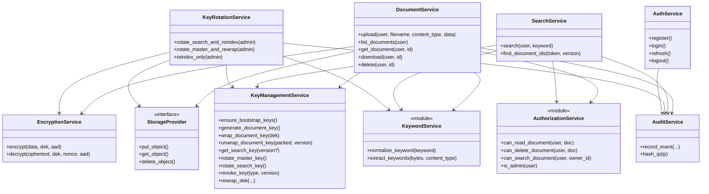

# Low-Level Design (LLD)

Companion to [ARCHITECTURE.md](ARCHITECTURE.md). This document describes core services as they exist in the codebase (`backend/app/services/`, `backend/app/security/`, `backend/app/crypto/`).

> **Naming note:** Some units are Python modules with functions (`keyword_service`, `authorization`) rather than classes. They are documented here under the architectural names used in the project plan.

## UML-style class / collaboration diagram

---

## 1. EncryptionService

**Location:** `backend/app/services/encryption_service.py` (thin wrapper over `app.crypto.encryption`)

### Purpose

Provide authenticated encryption and decryption of document bytes using AES-256-GCM.

### Inputs

| Input | Type | Meaning |
|-------|------|---------|
| `data` / plaintext | `bytes` | Document content |
| `dek` | `bytes` (32) | Per-document data encryption key |
| `associated_data` | `bytes \| None` | AAD bound into the tag (filename UTF-8) |
| For decrypt: `ciphertext`, `nonce` | `bytes` | Stored blob + stored nonce |

### Outputs

- Encrypt → `EncryptedPayload(ciphertext, nonce, algorithm="AES-256-GCM")`
- Decrypt → plaintext `bytes`
- Failure → `EncryptionError` (never returns partial plaintext)

### Dependencies

- `cryptography.hazmat.primitives.ciphers.aead.AESGCM`
- `app.crypto.random.random_nonce` (12-byte nonce)

### Security responsibility

- Confidentiality and integrity of document bytes under the DEK.
- Unique nonce per encryption under the same DEK (critical GCM requirement).
- Bind filename into AAD so ciphertext cannot be silently swapped under a different name without detection.

### Failure modes

| Failure | Behavior |
|---------|----------|
| Wrong DEK / wrong nonce / tampered ciphertext / wrong AAD | `InvalidTag` → `EncryptionError` |
| DEK length ≠ 32 | `EncryptionError` immediately |

---

## 2. KeyManagementService

**Location:** `backend/app/services/key_management_service.py`

### Purpose

Manage master-key versioning, DEK generation/wrapping, search-key lifecycle, and revocation metadata. Master material comes from environment (`MASTER_KEY`); this is **not** an HSM.

### Inputs

- DB session + `Settings` (`MASTER_KEY`)
- DEKs to wrap/unwrap; key type/version for rotate/revoke

### Outputs

- Random 32-byte DEKs
- Packed wrapped DEK (`nonce ‖ ciphertext`) + master key version
- Unwrapped search key bytes + version
- Status rows for admin UI (no raw key material)

### Dependencies

- `app.crypto.key_wrapping` (HKDF-SHA256 → KEK, AES-256-GCM wrap)
- `app.crypto.random.random_dek`
- `KeyVersion` model

### Security responsibility

- Never persist plaintext DEKs or search keys in PostgreSQL.
- Derive versioned KEKs via HKDF so “rotation” can advance crypto version even when the same env secret is used for educational master rotation.
- Separate search-key material from DEKs and KEKs.
- Refuse revoke of the currently ACTIVE key (must rotate first).

### Failure modes

| Failure | Behavior |
|---------|----------|
| Short / missing `MASTER_KEY` | Startup / construction error |
| No active master/search version | `KeyManagementError` |
| Bad wrapped blob | unwrap authentication failure |
| Revoke ACTIVE | rejected |

See [KEY_MANAGEMENT.md](KEY_MANAGEMENT.md).

---

## 3. KeywordService

**Location:** `backend/app/services/keyword_service.py` (module functions)

### Purpose

Deterministic keyword normalization and educational text extraction so index tokens are stable across upload and query.

### Inputs

- Raw keyword string or document bytes (+ optional content type)

### Outputs

- Normalized string (or empty)
- `set[str]` of tokens (capped at 500 per document)

### Dependencies

- Unicode NFKC, regex tokenization (`[a-z0-9]+(?:-[a-z0-9]+)*`)

### Security responsibility

- Determinism: same logical keyword → same normalized form → same HMAC token.
- Do not invent keywords from binary/PDF without a text layer (returns empty set—documented limitation).
- Cap token count to reduce index abuse.

### Failure modes

| Failure | Behavior |
|---------|----------|
| `None` keyword | `ValueError` |
| Non-UTF-8 binary | empty keyword set (latin-1 fallback may produce noise in demos) |

Policy details: [SEARCHABLE_ENCRYPTION.md](SEARCHABLE_ENCRYPTION.md).

---

## 4. SearchService

**Location:** `backend/app/services/search_service.py`

### Purpose

Convert a user keyword into an HMAC search token, look up matching documents, then **filter by authorization** before returning results.

### Inputs

- Authenticated `User`, keyword string, optional client IP for audit

### Outputs

- `list[Document]` metadata (authorized only)
- Audit `SEARCH` event with result counts and token **prefix** only (not full secret keyword)

### Dependencies

- `normalize_keyword`, `generate_search_token`
- `KeyManagementService.get_search_key()`
- `can_search_document`
- `AuditService`

### Security responsibility

- Index layer sees tokens, not plaintext keywords (backend still sees plaintext keyword in memory during the request—honest A5 caveat).
- Defense-in-depth: never return another user’s documents even if the token matched.
- No bulk decryption during search.

### Failure modes

| Failure | Behavior |
|---------|----------|
| Empty after normalize | empty list |
| No index hits | empty list + audit |
| Authz filters all | empty authorized list |

---

## 5. DocumentService

**Location:** `backend/app/services/document_service.py`

### Purpose

Orchestrate upload (encrypt + index), list/get/delete, and download (unwrap + decrypt).

### Inputs

- User, file bytes, filename, content type
- Document UUID for read/download/delete

### Outputs

- `Document` ORM rows / plaintext bytes on download
- HTTP errors via FastAPI `HTTPException` for callers

### Dependencies

- EncryptionService, KeyManagementService, KeywordService (extract), StorageProvider, AuditService, authorization helpers

### Security responsibility

- Enforce size and content-type limits.
- Sanitize filenames (strip path components).
- Store only ciphertext in object storage; wrapped DEK + nonce in DB.
- Authorize before metadata read/download/delete; use 404 (not 403) for unauthorized IDOR to reduce existence leakage to other users.
- On GCM failure: audit `DECRYPTION_FAILURE`, return 500 without plaintext.

### Failure modes

| Failure | Behavior |
|---------|----------|
| Empty / oversized / bad type | 422 / 413 |
| Unauthorized | 404 + `AUTHORIZATION_FAILURE` audit |
| Storage/crypto failure on download | 500 + decrypt audit |

---

## 6. AuthorizationService

**Location:** `backend/app/security/authorization.py` (module)

### Purpose

Role- and ownership-based access checks used after authentication and after search index matching.

### Inputs

- `User`, `Document` or `owner_id`

### Outputs

- Boolean allow/deny

### Rules

| Check | Rule |
|-------|------|
| `is_admin` | `role == ADMIN` and `is_active` |
| `can_read_document` / `can_delete_document` | admin or owner |
| `can_search_document` | admin or `owner_id == user.id` |

### Security responsibility

- Prevent IDOR and cross-user search result leakage.
- Inactive users always denied.

### Failure modes

Callers map `False` to 404/empty results—authorization itself does not throw.

---

## 7. AuditService

**Location:** `backend/app/services/audit_service.py`

### Purpose

Append structured security-relevant events without logging secrets or plaintext content.

### Inputs

- `action`, `success`, optional `user_id`, resource fields, IP, metadata dict

### Outputs

- Persisted `AuditLog` row (`ip_hash` = SHA-256 of IP)

### Dependencies

- SQLAlchemy `AuditLog` model

### Security responsibility

- Strip blocked metadata keys: `password`, `token`, `dek`, `master_key`, `search_key`, `jwt`, `plaintext`.
- Prefer hashes / counts / token prefixes over sensitive values.

### Failure modes

Does not raise on normal use; callers own transaction commit/rollback.

---

## Supporting services (brief)

| Service | Role |
|---------|------|
| **AuthService** | Register/login, Argon2id, JWT access, refresh rotation, logout |
| **KeyRotationService** | Search rotate + reindex; master rotate + DEK rewrap; reindex-only |

---

## Cross-references

- Crypto primitives: [KEY_MANAGEMENT.md](KEY_MANAGEMENT.md), [SEARCHABLE_ENCRYPTION.md](SEARCHABLE_ENCRYPTION.md)
- Threats: [THREAT_MODEL.md](THREAT_MODEL.md)
- API mapping: [API_DESIGN.md](API_DESIGN.md)
- Sequences: [diagrams/07-upload-sequence.md](diagrams/07-upload-sequence.md) et seq.
