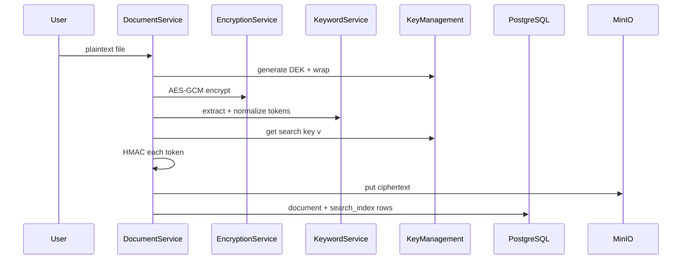
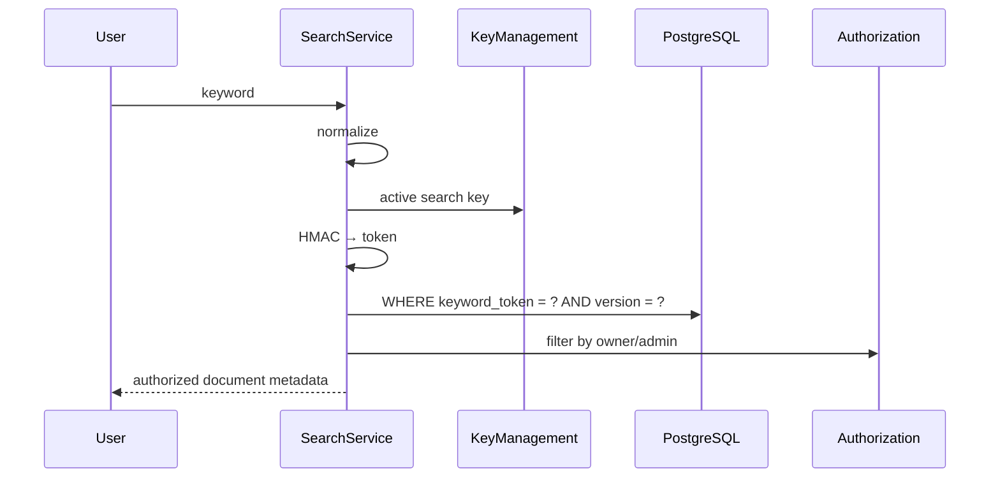

# Searchable Encryption (SSE v1)

This project implements a **deterministic HMAC-based searchable encryption** scheme suitable for teaching. It is **not** zero-knowledge and **not** leakage-free.

Related: [ARCHITECTURE.md](ARCHITECTURE.md), [KEY_MANAGEMENT.md](KEY_MANAGEMENT.md), [SECURITY_ANALYSIS.md](SECURITY_ANALYSIS.md), [diagrams/12-searchable-index-flow.md](diagrams/12-searchable-index-flow.md).

## Problem statement

Users want to find documents containing a keyword while:

- Document **bodies** remain encrypted at rest.
- The **index** does not store plaintext keywords.
- The system does **not** decrypt every document on each search.

## Scheme overview (v1)

\[
\text{token} = \mathrm{hex}\big(\mathrm{HMAC\text{-}SHA256}(K_{\text{search}}^{(v)}, \mathrm{normalize}(w))\big)
\]

- \(K_{\text{search}}^{(v)}\): versioned 32-byte search key  
- \(w\): user keyword or extracted document token  
- Index row: `(keyword_token, document_id, search_key_version)`

Identical normalized keywords under the same search-key version produce **identical tokens** (equality leakage).

## Normalization policy

Implemented in `normalize_keyword` / `extract_keywords`:

1. Strip leading/trailing whitespace  
2. Unicode **NFKC**  
3. Lowercase  
4. Collapse internal whitespace  
5. Keep hyphenated tokens matching `[a-z0-9]+(?:-[a-z0-9]+)*`; drop other punctuation  
6. Join remaining tokens with spaces  
7. On upload, index **individual tokens** (cap 500 / document)

**Educational extraction:** decode UTF-8 (latin-1 fallback). Binary/PDF without extractable text may yield **no** keywords—documented limitation, not a bug claim of “AI OCR.”

## End-to-end flows

### Indexing (upload)

### Query (search)

**Important:** the HTTP API currently accepts the plaintext keyword and performs HMAC on the **trusted backend**. The cloud **index** never stores the keyword; the backend process still sees it (A5). A stricter “trapdoor generated only on client” design would move HMAC client-side and change the trust story.

### Download

Search does **not** decrypt. Download unwraps DEK and AES-GCM-decrypts one object after authz.

## What the index adversary sees

| Visible | Hidden (without search key) |
|---------|-----------------------------|
| Opaque 64-hex tokens | Keyword strings |
| Which document IDs share a token | Semantic meaning of the token |
| Token frequency across corpus | Guaranteed keyword identity without oracle/aux data |

With the search key, an adversary can compute HMAC for guesses (**dictionary / verification**).

## Leakage (must memorize for viva)

1. **Search-pattern / equality leakage** — repeated queries for the same keyword are linkable; documents sharing a keyword share a token.  
2. **Access-pattern leakage** — which document IDs are returned; which objects are downloaded.  
3. **Metadata leakage** — filenames, sizes, owners, timestamps.  
4. **Inference** — with public knowledge (e.g., “only medical docs mention *hemochromatosis*”), tokens may be inferable.

## What we do **not** claim

- Zero knowledge  
- Zero leakage  
- Perfect privacy / anonymity  
- Forward or backward privacy  
- Protection against all inference attacks  
- Security under full application compromise (A5)

## Future stronger SSE (pluggable direction)

If extended later, implement as a **separate module** with its own security claims:

| Direction | Idea | Tradeoff |
|-----------|------|----------|
| Randomized / synthetic IVs per occurrence | Reduce cross-document equality for same keyword | Larger index; harder exact match |
| SSE-2 / dynamic SSE literature constructions | Better leakage profiles under formal models | Complexity; may need pairing or heavier crypto |
| Blinded trapdoors from client | Backend never sees keyword | Client key UX; key sync |
| ORAM / oblivious maps | Hide access patterns | Large performance cost |
| Padding / batching | Reduce volume leakage | Bandwidth/storage cost |

Do **not** rename v1 as “strong SSE” without changing the construction and rewriting [SECURITY_ANALYSIS.md](SECURITY_ANALYSIS.md).

## API honesty note

`SearchResponse` includes an explicit note that deterministic tokens leak equality of repeated queries. Keep that note if you write a paper or slide deck.

## Student takeaway

Searchable encryption is a **controlled leak** to buy **search without full decrypt**. Deterministic HMAC is the simplest teaching scheme: efficient, easy to implement, and honest about equality leakage.
