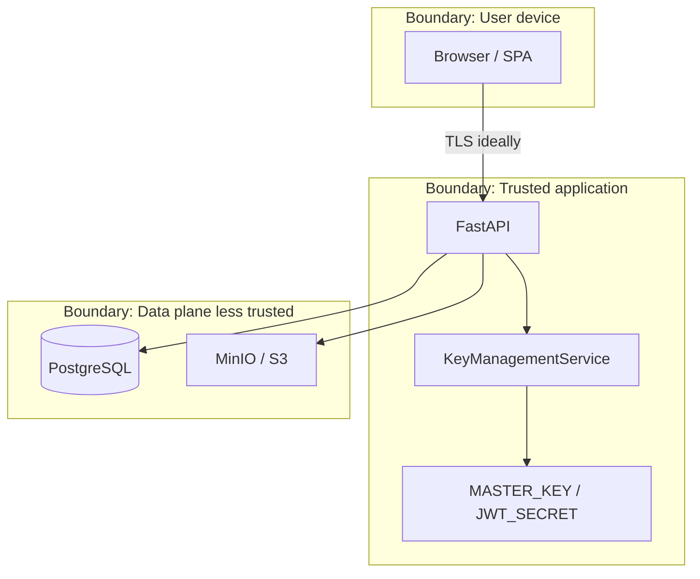

# Threat Model

This threat model is **intentionally honest**. The project prioritizes teaching real cloud searchable-encryption tradeoffs over marketing claims.

Related: [SECURITY_ANALYSIS.md](SECURITY_ANALYSIS.md), [ARCHITECTURE.md](ARCHITECTURE.md), [diagrams/15-threat-model.md](diagrams/15-threat-model.md).

## Assets

| Asset | Sensitivity | Where it lives |
|-------|-------------|----------------|
| Document plaintext | Critical | Transient in backend memory during upload/download/reindex |
| DEK | Critical | Transient; at rest only wrapped |
| Master key material (`MASTER_KEY`) | Critical | Environment / process memory (not an HSM in this demo) |
| Search key | Critical | Wrapped at rest; plaintext in memory for token ops |
| Password | High | Argon2id hash only in DB |
| JWT / refresh tokens | High | Client; refresh hashed in DB |
| Search tokens + index | Medium | PostgreSQL (equality leakage) |
| Ciphertext | Medium | MinIO/S3 |
| Metadata (filename, size, owner, timestamps) | Medium | PostgreSQL |
| Audit logs | Medium | PostgreSQL (sanitized) |

## Trust boundaries

Primary educational adversary: **honest-but-curious cloud storage / database**.  
Do **not** claim a fully compromised application server is harmless.

---

## Adversaries

### A1 — Curious Cloud Operator

**Who:** Operator of object storage (MinIO/S3) and/or someone who can observe storage APIs and possibly query patterns at the storage layer.

**Can observe:**

- Ciphertext blobs and object keys
- Blob sizes / timing of gets/puts (access patterns at storage layer)
- Possibly correlated metadata if they also see DB backups (depends on deployment)

**Cannot directly obtain (if key-management boundary remains trusted):**

- Document plaintext
- Master key / search key / DEKs
- Plaintext keywords from the index alone (index stores HMAC tokens)

**Risks that remain:**

- Equality / frequency inference if they also see the searchable index (A2 overlap)
- Metadata inference from sizes and filenames (filenames are in DB, not in MinIO content)
- Timing side channels

**Mitigations in this project:** AES-256-GCM ciphertext only in object storage; no plaintext uploads left at rest.

---

### A2 — Database Attacker

**Who:** Attacker with read (or write) access to PostgreSQL.

**Can obtain:**

- User rows (email, Argon2id password hashes, roles)
- Document metadata, wrapped DEKs, nonces, key versions
- `search_index` keyword tokens and document IDs
- Refresh token hashes, audit logs
- Wrapped search-key material in `key_versions`

**Must not obtain (design goals):**

- Plaintext passwords
- Plaintext DEKs or master key (not stored in DB)
- Plaintext document bodies

**Residual risks:**

- Offline attacks on weak passwords (Argon2id raises cost but does not eliminate weak passphrases)
- Equality leakage among search tokens; with auxiliary information, keyword inference may be possible
- If master key is later stolen separately, wrapped DEKs become decryptable
- Write access enables integrity attacks on metadata/index (app may detect ciphertext tampering via GCM)

**Mitigations:** Argon2id; wrapped keys; HMAC tokens; authorization still enforced in app; GCM tags on ciphertext and wraps.

---

### A3 — Unauthorized Application User

**Who:** Registered user (or stolen low-privilege session) attempting to exceed privileges.

**Attempts:**

- IDOR: read/download/delete another user’s document by UUID
- Search returning other users’ documents that share a keyword token
- Calling admin key/audit endpoints
- Token/JWT manipulation

**Mitigations:**

- Ownership checks in DocumentService / authorization module
- SearchService filters by `can_search_document`
- `require_admin` dependency (403)
- JWT signature verification; refresh rotation
- Security tests for IDOR and admin gates (see [TESTING.md](TESTING.md))

**Residual risks:** compromised victim credentials; phishing; overly permissive ADMIN accounts.

---

### A4 — Compromised Client

**Who:** Malware / shared device / XSS / stolen browser storage affecting the user’s endpoint.

**What can be protected:**

- Other users’ data remains protected by server-side authz and crypto (assuming backend intact)
- Server-side secrets (`MASTER_KEY`) are not shipped to the browser

**What cannot be protected:**

- The victim’s access token / refresh token while valid
- Anything the user can download or search during the compromise
- Password typed into the login form
- UI-visible metadata for that account

**Mitigations (partial):** short-lived access JWTs, refresh rotation/revocation, logout, HTTPS in production, CSP/secure headers (educational headers present; full browser hardening is incomplete).

---

### A5 — Fully Compromised Application Server

**Who:** Attacker with code execution or full memory/config access on the FastAPI host.

**Explicit limitation:** this **breaks the trust model**.

Attacker may:

- Read `MASTER_KEY` / `JWT_SECRET` from environment
- Unwrap DEKs and decrypt all documents
- Unwrap search keys and forge arbitrary search tokens
- Observe plaintext keywords and document contents during legitimate processing
- Impersonate any user by minting JWTs
- Disable or forge audit logs if they control the DB connection

**There is no cryptographic magic in this project that survives A5.** Production hardening means reducing A5 likelihood (HSM/KMS, least privilege, attestation, secrets manager, EDR, network segmentation)—not pretending envelope encryption alone stops a malicious app process.

---

## STRIDE-style summary

| Category | Examples in this system |
|----------|-------------------------|
| Spoofing | Stolen JWT; forged identity |
| Tampering | Modified ciphertext (detected by GCM); modified index rows |
| Repudiation | Mitigated partially by audit logs |
| Information disclosure | SSE equality leakage; metadata; A5 plaintext |
| Denial of service | Upload floods; rate limits are educational/in-memory only |
| Elevation of privilege | USER → admin API without role check (tested) |

## Out of scope (educational build)

- Formal proofs of SSE security games
- ORAM / oblivious access patterns
- Multi-party computation / client-side-only encryption UX
- Hardware HSM integration (documented as future work)

## Student takeaway

Encryption at rest against **curious storage** is realistic. Deterministic searchable encryption **trades privacy for efficiency**. A **compromised backend is fatal**—say that clearly in any viva.
