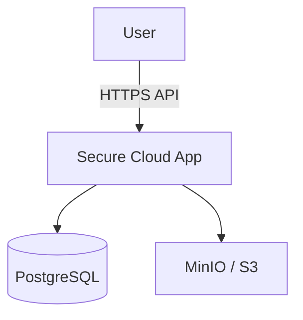

# 01 — Context Diagram

**What this shows:** System context — user, application, database, object storage.  
**Why it exists:** Orient students before diving into components.  
**Components:** User browser; Secure Cloud App (API+UI); PostgreSQL; MinIO/S3.  
**Student takeaway:** Ciphertext and tokens leave the app toward less-trusted stores.

