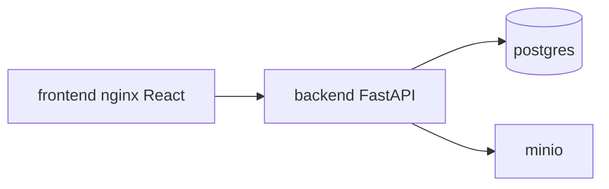

# 02 — Container Architecture

**What:** Deployable containers. **Why:** Maps to Docker Compose. **Takeaway:** Separation of UI, API, DB, objects.

```mermaid
flowchart LR
  FE[frontend nginx React]
  BE[backend FastAPI]
  PG[(postgres)]
  Minio[minio]
  FE --> BE
  BE --> PG
  BE --> Minio
```
