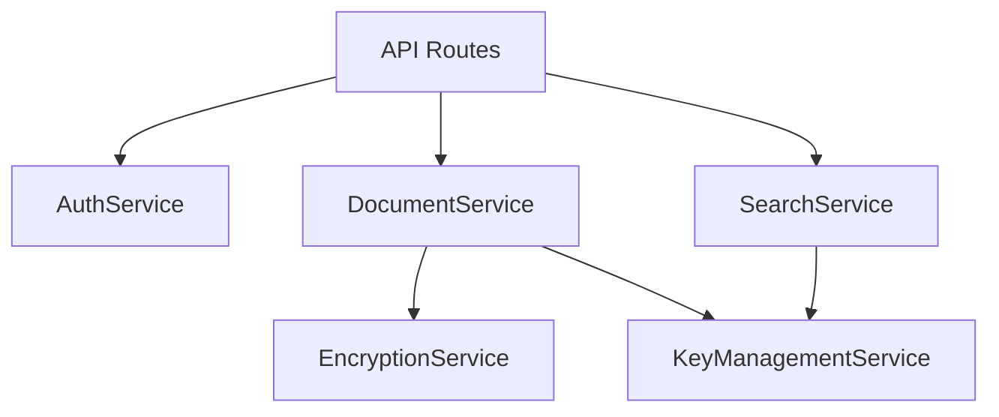

# 03 — Component Diagram

**What:** Backend services. **Why:** Shows modular crypto vs business logic. **Takeaway:** Crypto isolated under `crypto/` + services.

```mermaid
flowchart TB
  API[API Routes]
  Auth[AuthService]
  Doc[DocumentService]
  Search[SearchService]
  KMS[KeyManagementService]
  Enc[EncryptionService]
  API --> Auth
  API --> Doc
  API --> Search
  Doc --> Enc
  Doc --> KMS
  Search --> KMS
```
