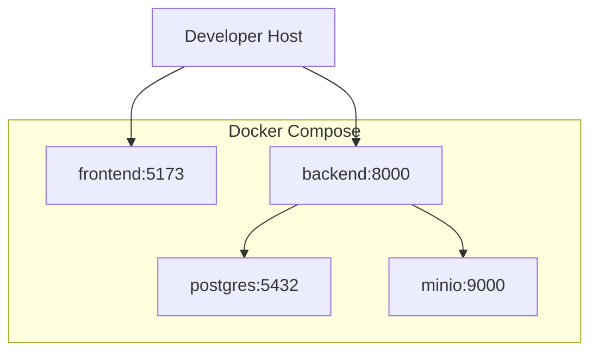

# 04 — Deployment Diagram

**What:** Compose topology with healthchecks. **Why:** Reproduce local lab. **Takeaway:** Non-root backend; MinIO simulates S3.

```mermaid
flowchart TB
  Dev[Developer Host]
  subgraph compose [Docker Compose]
    FE[frontend:5173]
    BE[backend:8000]
    PG[postgres:5432]
    MN[minio:9000]
  end
  Dev --> FE
  Dev --> BE
  BE --> PG
  BE --> MN
```
