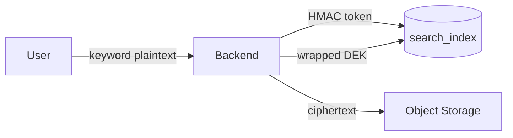

# 05 — Data Flow Diagram

**What:** Where plaintext vs ciphertext flows. **Why:** Clarify trust. **Takeaway:** Plaintext exists briefly only in trusted backend memory.

```mermaid
flowchart LR
  U[User] -->|keyword plaintext| BE[Backend]
  BE -->|HMAC token| PG[(search_index)]
  BE -->|ciphertext| S3[Object Storage]
  BE -->|wrapped DEK| PG
```
