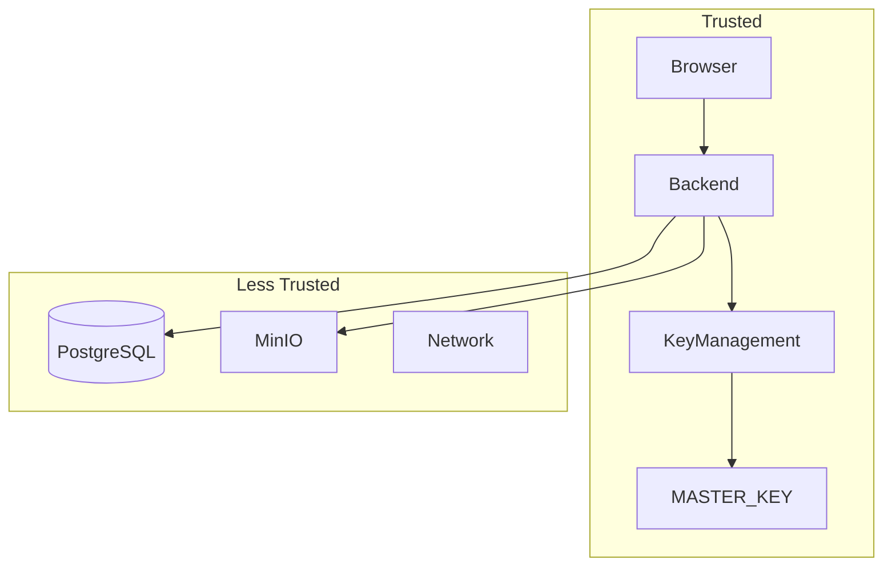

# 06 — Trust Boundary Diagram

**What:** Trusted vs untrusted zones. **Why:** Core of threat model. **Takeaway:** Compromised backend breaks the model.

```mermaid
flowchart TB
  subgraph trusted [Trusted]
    Browser
    API[Backend]
    KMS[KeyManagement]
    Master[MASTER_KEY]
  end
  subgraph untrusted [Less Trusted]
    PG[(PostgreSQL)]
    S3[MinIO]
    Net[Network]
  end
  Browser --> API
  API --> KMS
  KMS --> Master
  API --> PG
  API --> S3
```
