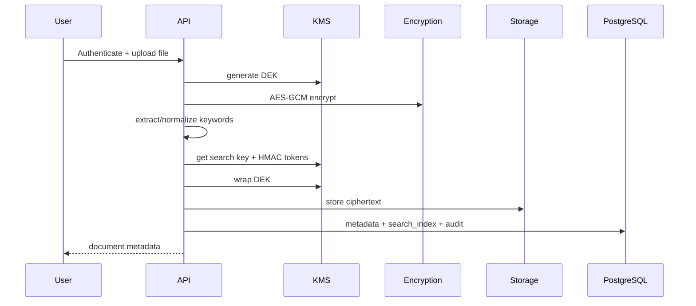

# 07 — Upload Sequence

**What:** End-to-end upload with crypto. **Why:** Mandatory teaching sequence. **Takeaway:** Encrypt and tokenize before durable storage.

```mermaid
sequenceDiagram
  participant U as User
  participant A as API
  participant K as KMS
  participant E as Encryption
  participant S as Storage
  participant DB as PostgreSQL
  U->>A: Authenticate + upload file
  A->>K: generate DEK
  A->>E: AES-GCM encrypt
  A->>A: extract/normalize keywords
  A->>K: get search key + HMAC tokens
  A->>K: wrap DEK
  A->>S: store ciphertext
  A->>DB: metadata + search_index + audit
  A-->>U: document metadata
```
