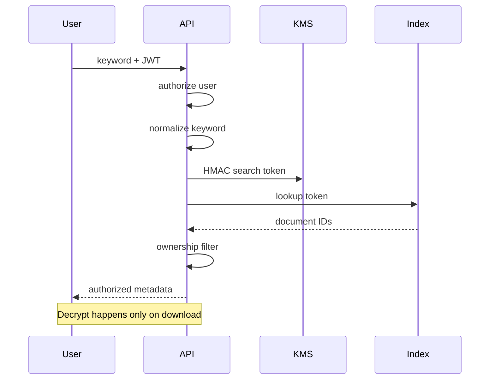

# 08 — Search Sequence

**What:** Protected search without bulk decrypt. **Why:** Distinguish search from decrypt. **Takeaway:** Index sees tokens only; authz filters results.

```mermaid
sequenceDiagram
  participant U as User
  participant A as API
  participant K as KMS
  participant DB as Index
  U->>A: keyword + JWT
  A->>A: authorize user
  A->>A: normalize keyword
  A->>K: HMAC search token
  A->>DB: lookup token
  DB-->>A: document IDs
  A->>A: ownership filter
  A-->>U: authorized metadata
  Note over U,A: Decrypt happens only on download
```
