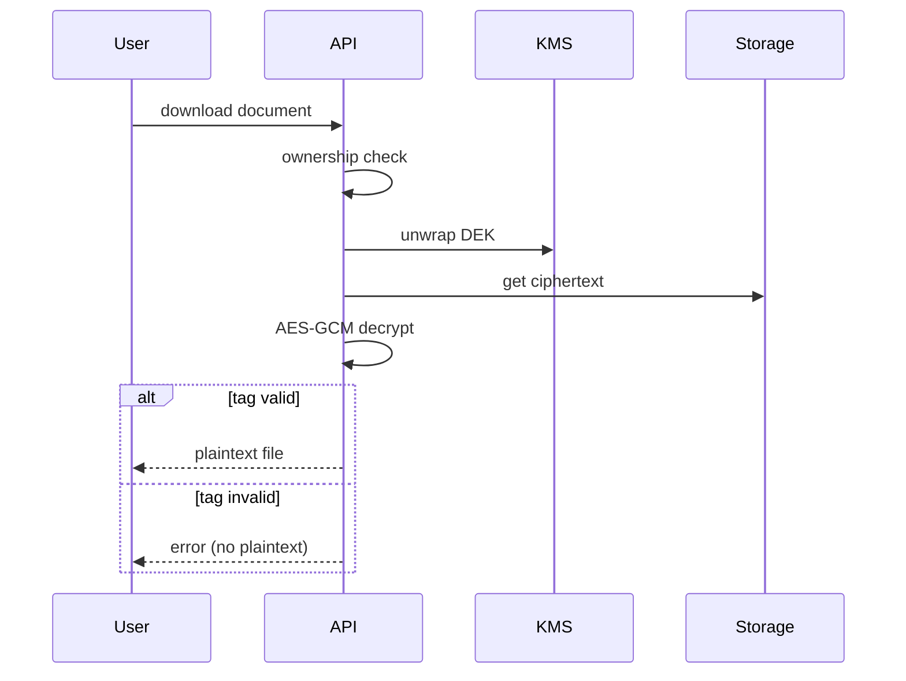

# 09 — Download / Decryption Sequence

**What:** Authorized decrypt path. **Why:** Show integrity fail-closed. **Takeaway:** GCM tag failure yields no plaintext.

```mermaid
sequenceDiagram
  participant U as User
  participant A as API
  participant K as KMS
  participant S as Storage
  U->>A: download document
  A->>A: ownership check
  A->>K: unwrap DEK
  A->>S: get ciphertext
  A->>A: AES-GCM decrypt
  alt tag valid
    A-->>U: plaintext file
  else tag invalid
    A-->>U: error (no plaintext)
  end
```
