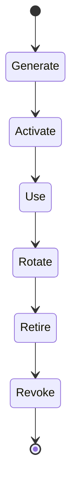

# 10 — Key Lifecycle

**What:** Generate→…→Revoke. **Why:** Key management teaching. **Takeaway:** Search rotation needs reindex.

```mermaid
stateDiagram-v2
  [*] --> Generate
  Generate --> Activate
  Activate --> Use
  Use --> Rotate
  Rotate --> Retire
  Retire --> Revoke
  Revoke --> [*]
```
