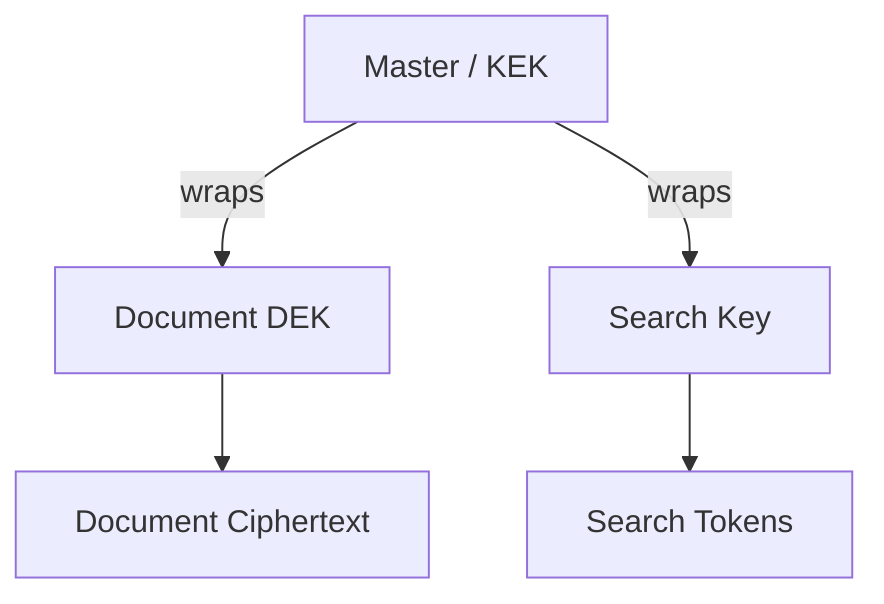

# 11 — Key Hierarchy

**What:** Master/KEK, DEK, Search Key. **Why:** Enforce separation of duties. **Takeaway:** Three distinct key roles.

```mermaid
flowchart TB
  Master[Master / KEK]
  DEK[Document DEK]
  SK[Search Key]
  CT[Document Ciphertext]
  Tok[Search Tokens]
  Master -->|wraps| DEK
  Master -->|wraps| SK
  DEK --> CT
  SK --> Tok
```
