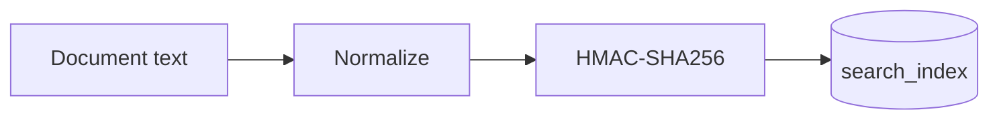

# 12 — Searchable Index Flow

**What:** Keyword → token → inverted index. **Why:** SSE core. **Takeaway:** No plaintext keywords in table.

```mermaid
flowchart LR
  Doc[Document text]
  Norm[Normalize]
  HMAC[HMAC-SHA256]
  Idx[(search_index)]
  Doc --> Norm --> HMAC --> Idx
```
