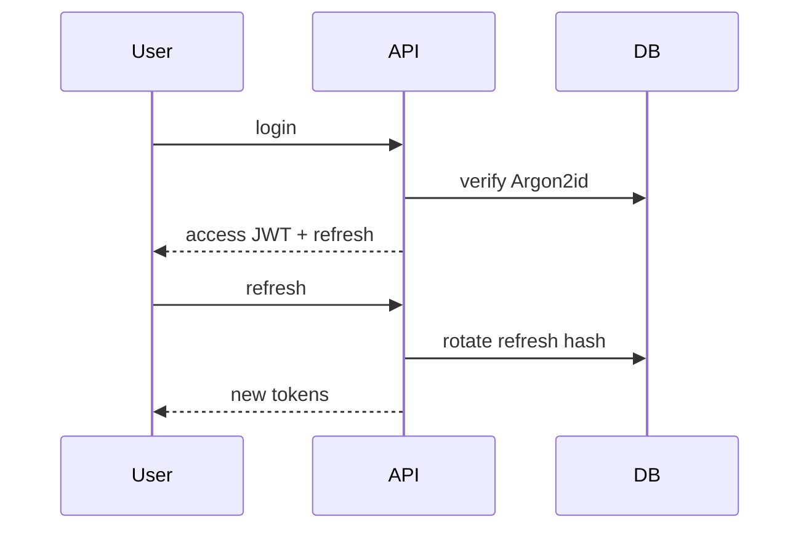

# 13 — Authentication Flow

**What:** Register/login/JWT/refresh. **Why:** Identity foundation. **Takeaway:** Argon2id + rotating refresh.

```mermaid
sequenceDiagram
  participant U as User
  participant A as API
  participant DB as DB
  U->>A: login
  A->>DB: verify Argon2id
  A-->>U: access JWT + refresh
  U->>A: refresh
  A->>DB: rotate refresh hash
  A-->>U: new tokens
```
