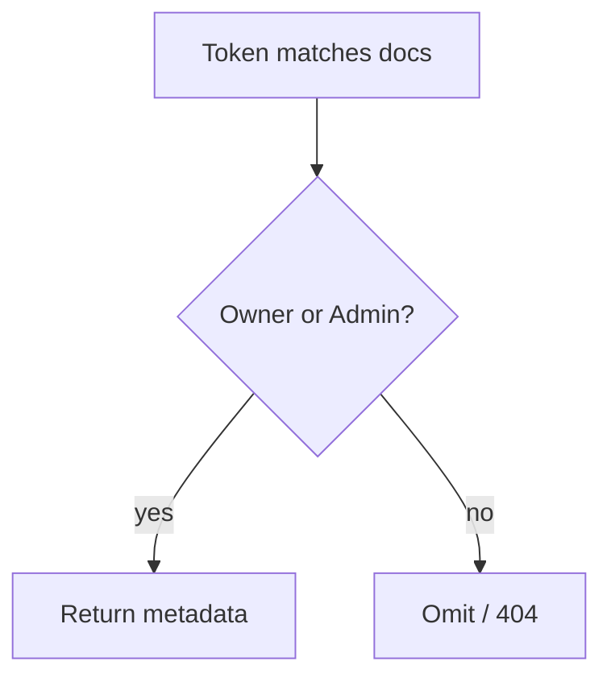

# 14 — Authorization Flow

**What:** Defense-in-depth after search. **Why:** Tokens ≠ permission. **Takeaway:** Always filter by owner/role.

```mermaid
flowchart TD
  Match[Token matches docs]
  Authz{Owner or Admin?}
  Allow[Return metadata]
  Deny[Omit / 404]
  Match --> Authz
  Authz -->|yes| Allow
  Authz -->|no| Deny
```
