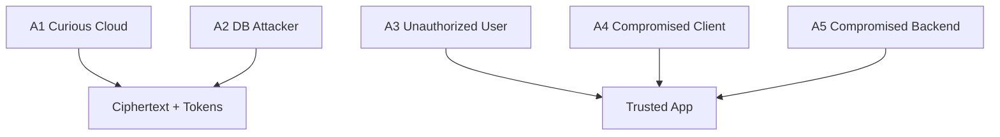

# 15 — Threat Model Diagram

**What:** Adversaries A1–A5. **Why:** Honest limitations. **Takeaway:** A5 (backend compromise) is fatal.

```mermaid
flowchart TB
  A1[A1 Curious Cloud]
  A2[A2 DB Attacker]
  A3[A3 Unauthorized User]
  A4[A4 Compromised Client]
  A5[A5 Compromised Backend]
  Store[Ciphertext + Tokens]
  App[Trusted App]
  A1 --> Store
  A2 --> Store
  A3 --> App
  A4 --> App
  A5 --> App
```
