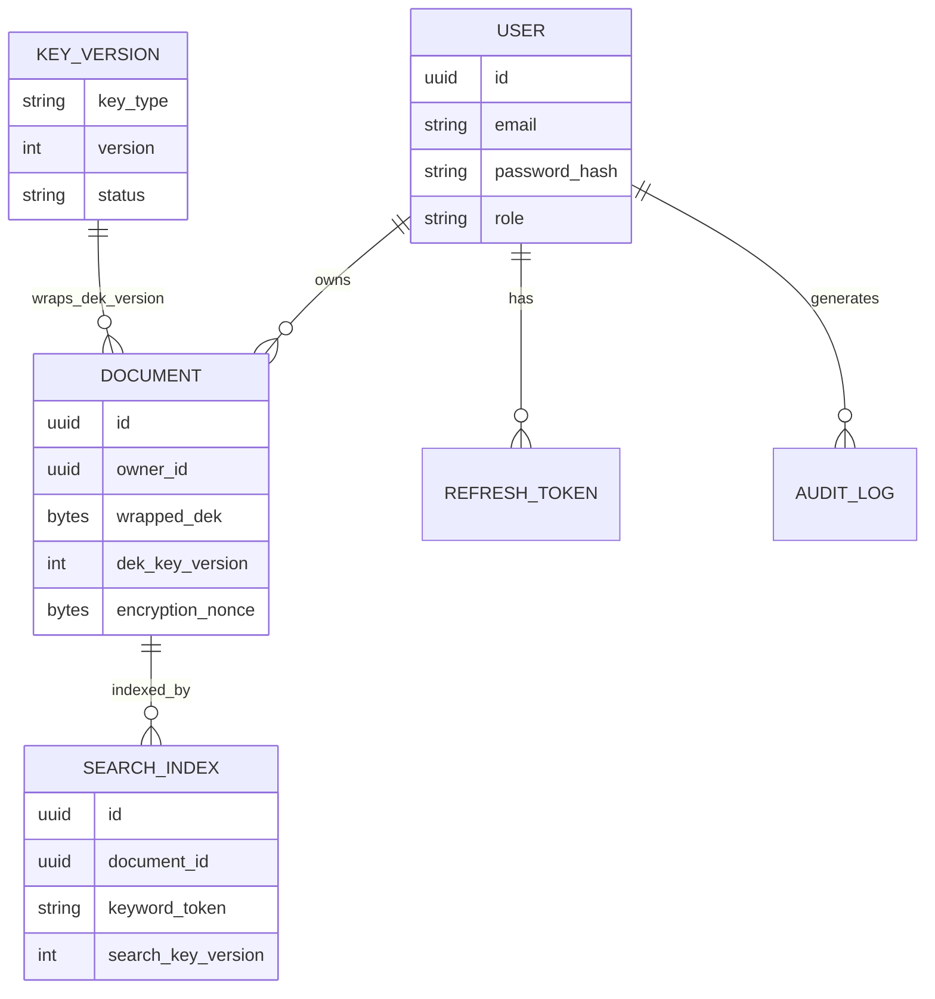

# 16 — ER Diagram

**What:** Relational schema. **Why:** DB design teaching. **Takeaway:** Tokens reference documents; keys versioned.

```mermaid
erDiagram
  USER ||--o{ DOCUMENT : owns
  DOCUMENT ||--o{ SEARCH_INDEX : indexed_by
  USER ||--o{ REFRESH_TOKEN : has
  USER ||--o{ AUDIT_LOG : generates
  KEY_VERSION ||--o{ DOCUMENT : wraps_dek_version
  USER {
    uuid id
    string email
    string password_hash
    string role
  }
  DOCUMENT {
    uuid id
    uuid owner_id
    bytes wrapped_dek
    int dek_key_version
    bytes encryption_nonce
  }
  SEARCH_INDEX {
    uuid id
    uuid document_id
    string keyword_token
    int search_key_version
  }
  KEY_VERSION {
    string key_type
    int version
    string status
  }
```
